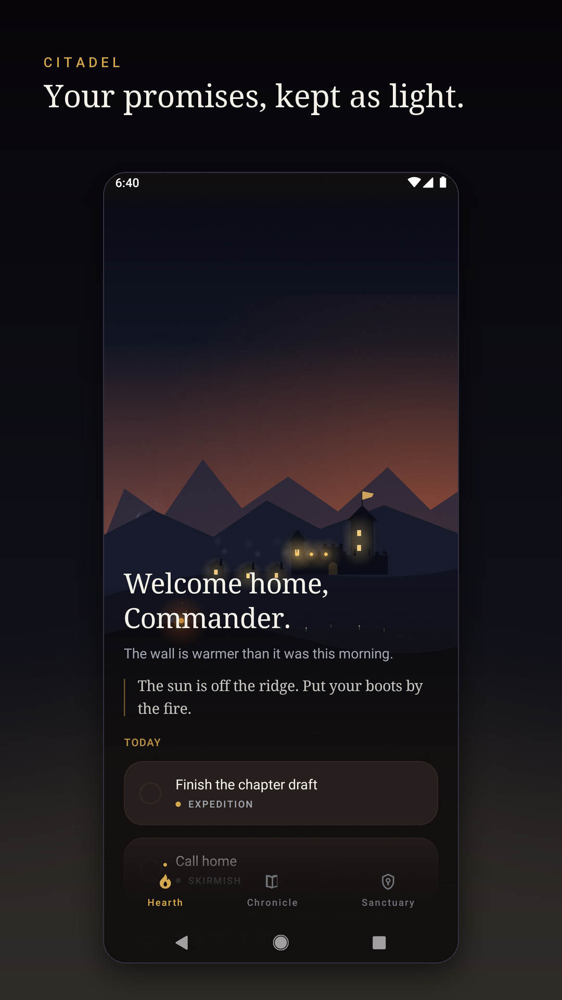
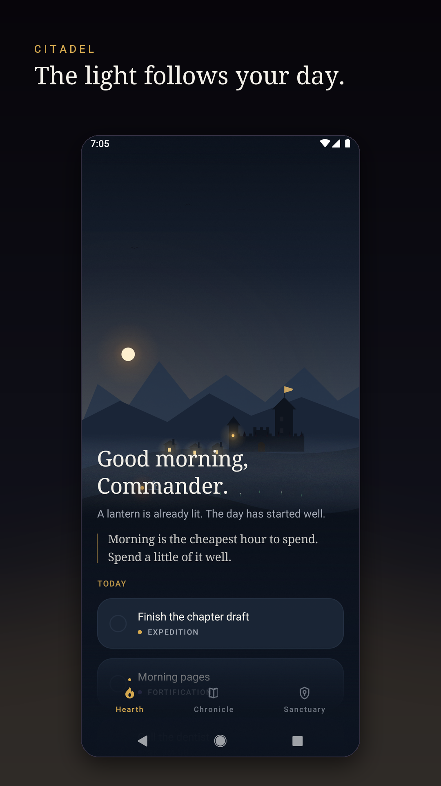
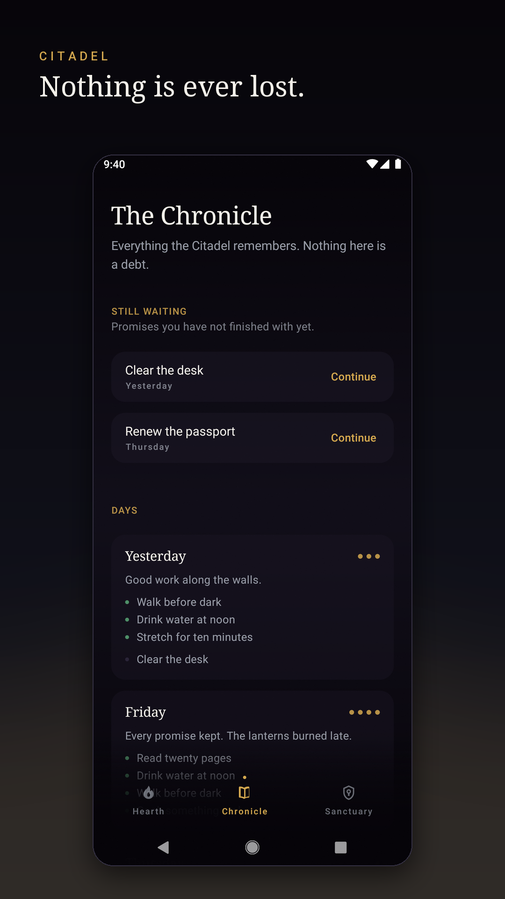
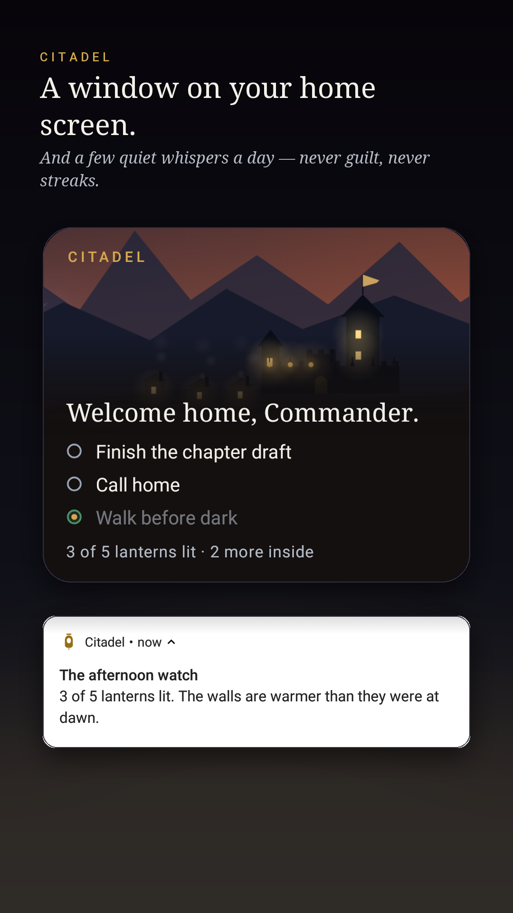

# Citadel

**A quiet kingdom that grows brighter every time you keep a promise to yourself.**


Citadel is an Android task app that doesn't feel like one. Each day you name a few real
things you mean to do. Keep one, and the kingdom answers — a lantern lights along the wall,
the windows warm, the fire grows. Keep them for weeks and the world slowly comes to life.

There are no points, badges or streaks. Unfinished missions are never "overdue"; they rest
in the Chronicle until you want them again. Time away brings mist over the valley, never ruin.

<p>
  
  
  
  
</p>

## What's inside

- **The Hearth** — the world is the screen. It follows the real hour: mist at dawn, long
  light in the afternoon, a warm horizon at dusk, stars at night. Today's missions sit on
  its lower ground and scroll up out of it.
- **Missions** — one field, three weights (Skirmish, Fortification, Expedition), once or
  every day. The heavier the promise, the more the world moves when it's kept.
- **The evening ritual** — prepare tomorrow before sleep. Five is suggested, never required.
- **The Chronicle** — every day remembered, and every unfinished promise one tap from
  *Continue*.
- **Whispers** — up to five notifications a day (dawn, midday, afternoon, evening, night),
  adjustable to four or two, on your own hours. They replace each other rather than
  stacking, and stay silent while you're in the app.
- **Widget** — the same world on your home screen, drawn by the same painters.
- **Guide** — a five-page tour on first launch, replayable from the Sanctuary.
- **Private by construction** — everything stays on the device. No account, no analytics,
  and no internet permission. See [PRIVACY.md](PRIVACY.md).

## Building

Requirements: Android Studio (it bundles the JDK 21 the build uses) and the Android SDK
for API 37.

```bash
./gradlew :app:assembleDebug        # debug APK
./gradlew :app:testDebugUnitTest    # unit tests
./gradlew :app:lintDebug            # Android lint
./gradlew :app:bundleRelease        # Play bundle (signed once you have an upload key)
```

To ship to Google Play, follow [RELEASING.md](RELEASING.md).

## Project layout

```
app/src/main/java/dev/atharva/citadel/
├─ core/time/     CitadelClock and SkyMoment — the continuous light curve
├─ data/          CitadelRepository (single source of truth), SettingsStore, JSON store
├─ domain/        DaySweep, DayView, WorldState, GuardianVoice, Whisper schedule & copy
├─ system/        Whispers — notification channels and the self-rearming alarm chain
├─ widget/        CitadelWidget — the home-screen widget
└─ ui/            scene/ (the world), hearth/, prepare/, ritual/, chronicle/,
                  sanctuary/, tour/, nav/, components/, theme/
app/src/debug/    developer-only tools (never compiled into release)
app/src/release/  release-only wiring
docs/             design documents, and the hosted privacy policy (docs/privacy/)
fastlane/         Play Store listing text, icon, feature graphic and screenshots
scripts/          upload-key creation, privacy-page generation
```

The rules that define the app — nothing is lost to time, permanent progress never goes
backwards, whispers never use guilt — are enforced in `data/` and `domain/`, and each has a
unit test named after the rule.

## Developer tools (debug builds only)

Pin the hour to see any time of day:

```bash
adb shell "run-as dev.atharva.citadel sh -c 'echo 18:40 > files/debug_clock'"
adb shell "run-as dev.atharva.citadel rm files/debug_clock"
```

Preview a whisper, redraw the widget, or re-render the store artwork:

```bash
adb shell am broadcast -a dev.atharva.citadel.debug.TOOLS -p dev.atharva.citadel --es cmd whisper --es slot DAWN
adb shell am broadcast -a dev.atharva.citadel.debug.TOOLS -p dev.atharva.citadel --es cmd widget
adb shell am broadcast -a dev.atharva.citadel.debug.TOOLS -p dev.atharva.citadel --es cmd art
```

## License

No license has been chosen yet, so all rights are reserved by the author.
