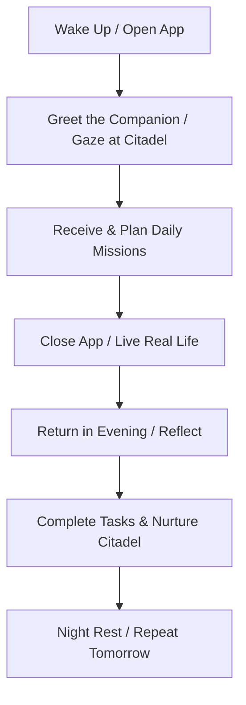

# Citadel Gameplay Loop: The Daily Ritual

## The Paradigm: The Real Game is Outside
Citadel does not want to lock the user into screen time. The gameplay loop is designed to get the user in, focus them, and send them back to their real-world activities. 

---

## The Phases

### Phase 1: The Morning Planning (Dawn / Day)
1.  **Opening the Gates**: The Commander opens the app. The theme is Dawn or Day. 
2.  **State Check**: The user sees the Citadel's current state. If they were active yesterday, smoke is rising, and the sky is clear. If they were away, soft mist or falling leaves cover the screen.
3.  **The Scout's Report**: The user checks active missions. They can draft new ones or review recurring promises.
4.  **Leaving the Fort**: The user closes the app to carry out their promises.

### Phase 2: The Evening Return (Dusk / Night)
1.  **Gathering at the Hearth**: The Commander returns after their day. The theme is warm Dusk or deep Night.
2.  **Reflecting & Reporting**: The Commander marks completed missions.
3.  **The Restoration**: As missions are marked done, a micro-animation fires. The fire gets brighter, lanterns spark, and mist clears.
4.  **Rest**: The Commander reads a short, comforting journal entry or companion thought, and closes the app to rest.
